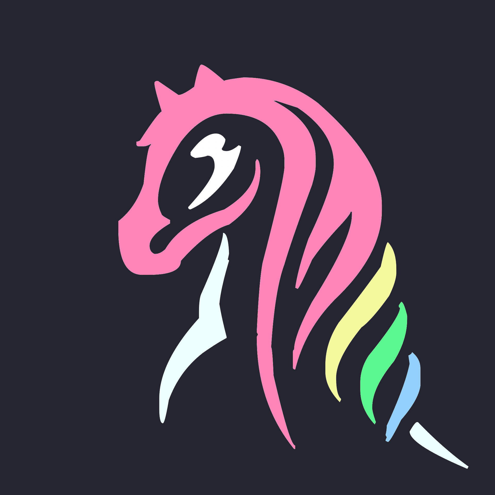

  

<h1 align="center">
  Natty
</h1>

  

## Pallette 🎨

| Base         |    Hex    | font-style  | scope                       |
| ------------ |:---------:|:-----------:|:----------------------------|
| Pink         |  #FF85B8  |    normal   | Keywords, Operators         |
| Blue         |  #94D0FF  |    normal   | Functions                   |
| Blue         |  #89DDFF  |    normal   | Punctuation                 |
| Yellow       |  #F3F99D  |    normal   | Numbers, Constants, Storage |
| White        |  #EEFFFF  |    normal   | Variables                   |
| Faded Silver | #B7C5D370 |    normal   | Comments                    |
| Green        |  #5AF78E  |    normal   | Strings                     |
| Dark         |  #242530  |     ---     | Background                  |

## Installation

1. Open the **Extensions** sidebar in VS Code
2. Search for `Natty`
3. Click **Install**
4. Open the **Command Palette** with `Ctrl+Shift+P` or `⇧⌘P`
5. Select **Preferences: Color Theme** and choose `Natty`.

>Inspired by <a href="https://github.com/sindresorhus/iterm2-snazzy">iterm2-snazzy</a>

### License

[MIT](LICENSE) © [Filipe Herculano](https://github.com/this-fifo)
